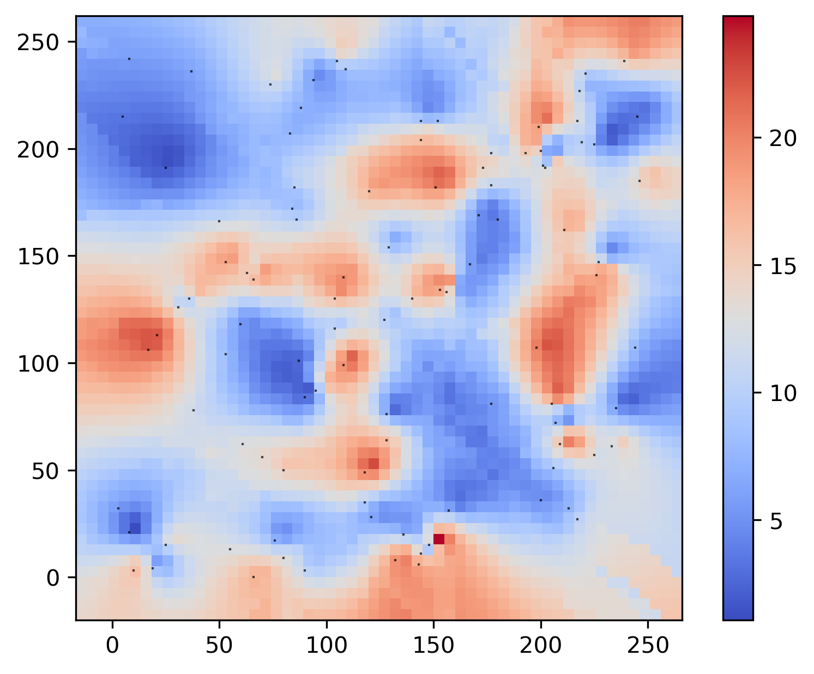

[](https://doi.org/10.5281/zenodo.4773587)
[](https://badge.fury.io/py/pysgems)
[](https://pepy.tech/project/pysgems)
[](https://pysgems.readthedocs.io/en/latest/?badge=latest)

# pysgems
Use SGeMS (Stanford Geostatistical Modeling Software) within Python.

Contributors / feedback from users are welcome.

SGeMS home page: http://sgems.sourceforge.net/

The kriging example described in this file can be found in the 'demo_kriging.py' file.

## Installation

Clone this repository, or:

```bash
pip install pysgems
```
Note that SGEMS only runs on Microsoft Windows.

Users need to add this variable to their system **environment variables**:

Name: `GSTLAPPLIHOME`

Value: Path to your SGEMS folder (e.g., `C:\Program Files (x86)\SGeMS`)

*Important*: It is also necessary to add the path of your SGEMS folder to the **system variable** 'Path'.

## Documentation

[pysgems.readthedocs.io](https://pysgems.readthedocs.io/en/latest/)

## Introduction

This package works by calling SGEMS via the command in the Command Prompt:
```bash
sgems.exe sgems.script
```

The sgems.script contains a command that SGEMS will execute internally:

```bash
RunScript python_script.py
```

The python_script file contains a Python script (ver. <= 2.7.x) that SGEMS will execute, as if ran into the `Run Script...` window of SGEMS.

This package revolves around modifying this Python script file.

## Usage

This package was designed with 2D estimation/simulation problems in mind, it should support 3D grids but it hasn't been tested yet.

### Creating an SGEMS project

#### Initiate
A SGEMS project is created by first creating a pjt object "Sgems". When you create the project object you can define the project's name, workspace path, results directory path, python scripts templates directory path, and the last parameter is the 'no-data' value to take into accounts 'no-data points'. All of these are optional parameters. If no result directory is provided, one will automatically be generated with an unique name.

```python
import os
from os.path import join as join_path

from pysgems.algo.sgalgo import XML
from pysgems.dis.sgdis import Discretize
from pysgems.io.sgio import PointSet
from pysgems.plot.sgplots import Plots
from pysgems.sgems import sg

# Initiate sgems project
cwd = os.getcwd()  # Working directory
rdir = join_path(cwd, 'results', 'demo_kriging')  # Results directory
pjt = sg.Sgems(project_name='sgems_test', project_wd=cwd, res_dir=rdir)
```

#### Load point set

The next step is to create a package object "PointSet". The first parameter of the PointSet class is a project object, which ties a PointSet object to a specific project. The second parameter is the path to the dataset file. The package expects the ASCII GEOEAS data format.

```python
# Load data point set
data_dir = join_path(cwd, 'datasets', 'demo_kriging')
dataset = 'sgems_dataset.eas'
file_path = join_path(data_dir, dataset)

ps = PointSet(project=pjt, pointset_path=file_path)
```

#### Tie the project to a grid

The next package to add is the spatial discretization package. Create a package object "Discretize". The first parameter is the project object to which the package will be tied. You have to input cell dimensions dx, dy. By default, dz=0. Optionally specify the grid bounding box by adding parameters xo, yo, zo, x_lim, y_lim, z_lim. If none is provided, the bounding box will automatically be computed based on the data points coordinates (assuming that a "PoinSet" object has been added to the project).

```python
# Generate grid. Grid dimensions can automatically be generated based on the data points
# unless specified otherwise, but cell dimensions dx, dy, (dz) must be specified
ds = Discretize(project=pjt, dx=5, dy=5)
```

#### Visualize your project geometry

To check your grid geometry and visualize data points, create a package object "Plots" and tie it to the project.

```python
# Display point coordinates and grid
pl = Plots(project=pjt)
pl.plot_coordinates()
```


#### Get algorithm XML from SGeMS

Users must first run their algorithm inside SGeMS, view the Commands Panel, copy the algorithm XML and paste it into a XML file (e.g., algorithm.xml), and save this file into the 'algorithms' folder.

The algorithm XML starts and ends with:
```xml
<parameters> ... </parameters>
```

Use a package object "XML" to load your algorithms. The first parameter is the project object. The second parameter is the path to the folder in which your algorithms xml files are stored.

```python
#  Load your algorithm xml file in the 'algorithms' folder.
algo_dir = join_path(os.path.dirname(cwd), 'algorithms')
al = XML(project=pjt, algo_dir=algo_dir)
```

Let's take for example the kriging algorithm stored in ../algorithms/kriging.xml.
Read the 'kriging.xml' file in the following way:

```python
al.xml_reader('kriging')
```

Display the XML structure:

```python

al.show_tree()

```

It will output:

```python
Path
{attribute1: value1, ..., attribute_n: value_n}
```

For the kriging algorithm the first lines will be:

```python
algorithm
{'name': 'kriging_mean'}
Variogram
{'nugget': '0', 'structures_count': '1'}
Variogram//structure_1
{'contribution': '1', 'type': 'Spherical'}
Variogram//structure_1//ranges
{'max': '150', 'medium': '150', 'min': '150'}
```

To modify an element:

```python
al.xml_update(path, attribute_name, new_value)
```

For example:

```python
al.xml_update('Variogram', 'nugget', '0.01')
al.xml_update('Variogram', 'structure_1', 'type', 'Exponential')
```

The following is also acceptable:

```python
al.xml_update('Variogram//structure_1//ranges', new_attribute_dict={'max': '150', 'medium': '150', 'min': '150'})
```

#### Exports needed point sets in SGEMS binary format.

In order to use the data set within SGEMS, it is necessary to export the needed point sets in the SGEMS binary format.
Get the list of features name available to export:

```python
print(sg.point_set.columns)
out: ['x', 'y', 'z', 'ag', 'as', 'au', 'cu', 'pb', 's', 'zn']
```

The line

```python
ps.export_01('feature_name')
```

Will export the desired feature point set in SGEMS binary format to the results folder. Rows containing the no-data value will not be exported.

At this time, the export_01 method only supports point sets for individual features. It should be extended to support grids and multiple features.

#### Run SGEMS

To load the updated XML algorithm into the SGEMS Python script template:

```python
sg.write_command()
```

The files will be loaded in the results folder (automatically generated or user-defined).

Run the algorithm by:

```python
sg.run()
```

It will generate a batch file and a script file. The batch file can later be used outside of Python.

Check the results:




## Contribution and points to improve

- Contributors and feedback from users are welcome. 

- The package should be made more robust and able to support all SGEMS features.

- More methods should be build to export/import binary grids and point sets with multiple features.

- The package should be properly documented.

- The package should have more built-in visualization methods.

- The Python script template should be more generic and its modification more flexible.

- More examples should be uploaded.
